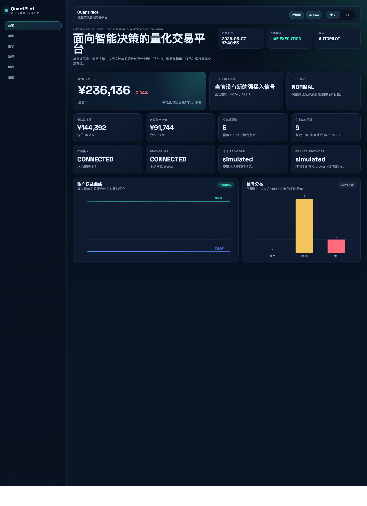
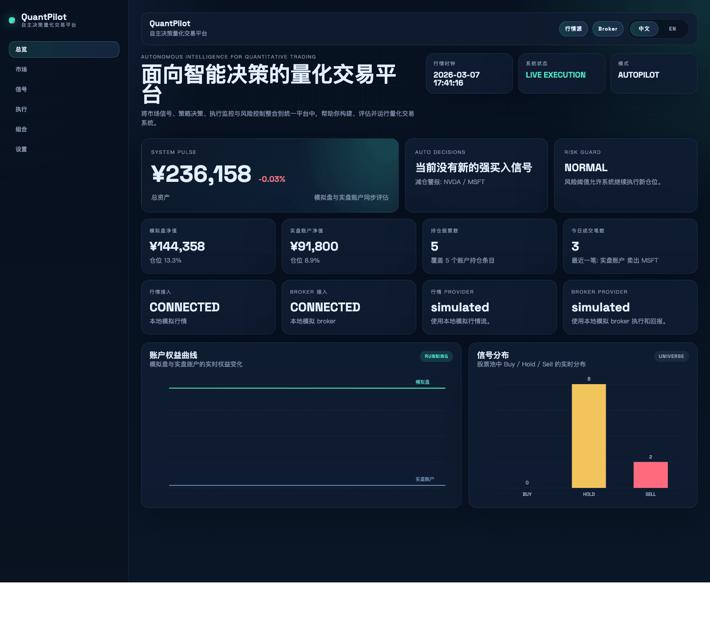
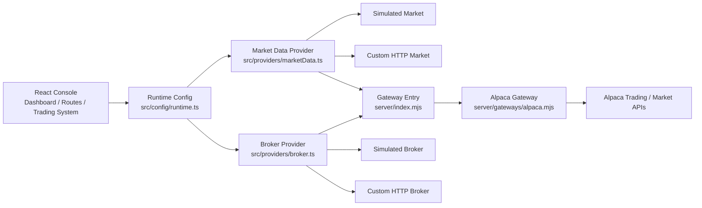

# quantpilot

[](https://github.com/rogerdigital/quantpilot/actions/workflows/ci.yml)
[](https://github.com/rogerdigital/quantpilot/commits/main)
[](LICENSE)
[](package.json)

Autonomous quantitative trading workspace prototype.

quantpilot 是一个基于 Vite、React 和 TypeScript 构建的量化交易平台原型，用统一界面承载市场监控、信号分析、策略编排、执行跟踪、风控管理与组合视图。

## Overview

quantpilot 面向两个目标：
- 快速演示一个自主决策交易平台的前端工作流
- 为行情、Broker、OMS 与风控接入预留清晰的扩展层

当前版本偏向产品原型、交互验证和接入层设计，不是可直接投入无人值守实盘的生产系统。

当前版本的定位是：
- 产品原型与前端平台壳
- 量化交易工作流演示与交互验证
- 行情 / Broker / OMS 接入层原型

不适合直接用于无人值守生产实盘交易。

## Highlights

- 自主决策交易引擎：基于趋势、动量、波动和风险阈值生成 `BUY / HOLD / SELL`
- 双账户模型：支持 `模拟盘` 与 `实盘账户` 状态展示
- 执行链路：支持订单提交、状态同步、撤单请求与成交回报展示
- 平台化导航：覆盖总览、市场、信号、执行、组合、设置
- 双语界面：支持中文 / English 切换
- 网关接入：支持本地模拟、`custom-http`、`alpaca`

## Preview

<table>
  <tr>
    <td width="58%">
      <a href="docs/media/quantpilot-overview.png">
        
      </a>
    </td>
    <td width="42%">
      <a href="docs/media/quantpilot-overview.gif">
        
      </a>
    </td>
  </tr>
  <tr>
    <td>Console overview</td>
    <td>Workflow demo</td>
  </tr>
</table>

## Architecture



前端通过 `runtime.ts` 选择 provider。`simulated` 与行情 `custom-http` 可直接在前端侧工作；涉及真实或半真实交易的 broker 接入应走同源网关，由服务端持有密钥并代理到外部 API。

## Route Map

核心页面包括：
- `/overview`
- `/market`
- `/signals`
- `/execution`
- `/portfolio`
- `/settings`

根路径 `/` 会重定向到 `/overview`。

## Stack

- Vite 5
- React 18
- TypeScript 5
- React Router 6
- CSS

## Getting Started

```bash
nvm use
npm install
cp .env.example .env
npm run gateway
npm start
```

默认地址：
- Frontend: `http://localhost:8080`
- Gateway: `http://localhost:8787`

如果只看前端界面，可先执行：

```bash
npm install
npm start
```

## Scripts

```bash
npm run gateway
npm run typecheck
npm run build
npm run preview
```

## Integrations

当前支持三类 provider：
- `simulated`
- `custom-http`
- `alpaca`

关键接入文件：
- [runtime.ts](src/config/runtime.ts)
- [marketData.ts](src/providers/marketData.ts)
- [broker.ts](src/providers/broker.ts)
- [index.mjs](server/index.mjs)
- [alpaca.mjs](server/gateways/alpaca.mjs)
- [.env.example](.env.example)

如果远程 provider 未配置或请求失败，系统会自动回退到本地模拟链路。

当前版本已补充两条更适合作为“半真实交易沙盒”的约束：
- 浏览器端不再读取 broker API key
- 远程下单会携带稳定的 `clientOrderId`，并保留待确认意图，降低批量部分成功后的重复下单风险
- live 远程订单可开启人工确认闸门，未批准前不会发往 broker

## Deployment

这是一个 SPA。前端可以直接静态部署，但 `server/index.mjs` 和 `server/gateways/alpaca.mjs` 仍需要单独运行或独立托管。

部署前端时，需要把所有路由重写到 `index.html`。

仓库已包含常见配置：
- [public/_redirects](public/_redirects) for Netlify
- [vercel.json](vercel.json) for Vercel
- [deployment.md](docs/deployment.md) for Nginx / generic static hosting

## Safety

- 当前项目是平台原型，不是生产级交易系统
- 不应直接用于无人值守实盘交易
- Alpaca 等真实密钥只应放在服务端网关，不应暴露到前端构建产物
- 若用于生产，需要补齐鉴权、审计、监控、限流、告警和完整风控
- `riskGuard` 在远程 broker 模式下会同时生成 live 减仓意图，而不再只影响 paper 账户

## Project Structure

```text
quantpilot/
├── index.html
├── package.json
├── vite.config.js
├── server/
│   ├── index.mjs
│   └── gateways/
│       └── alpaca.mjs
├── public/
│   └── favicon.svg
└── src/
    ├── App.tsx
    ├── main.tsx
    ├── components/
    │   └── Dashboard.tsx
    ├── css/
    │   └── style.css
    ├── data/
    │   └── market_data.json
    ├── config/
    │   └── runtime.ts
    ├── providers/
    │   ├── broker.ts
    │   └── marketData.ts
    ├── types/
    │   └── trading.ts
    └── system/
        └── useTradingSystem.tsx
```

## Environment

- 项目已增加 [.nvmrc](.nvmrc)
- `package.json` 已声明 `node >= 20.5.0`
- 如果本机 Node 版本偏低，先执行 `nvm use`

前端配置示例：

```bash
VITE_MARKET_DATA_PROVIDER=alpaca
VITE_BROKER_PROVIDER=custom-http
VITE_BROKER_HTTP_URL=/api/broker
VITE_ALPACA_PROXY_BASE=/api/alpaca
```

网关配置示例：

```bash
BROKER_ADAPTER=alpaca
ALPACA_KEY_ID=your_key
ALPACA_SECRET_KEY=your_secret
ALPACA_USE_PAPER=true
ALPACA_DATA_FEED=iex
```

如果接自定义 HTTP broker，可改为：

```bash
BROKER_ADAPTER=custom-http
BROKER_UPSTREAM_URL=https://your-broker-gateway.example.com
BROKER_UPSTREAM_API_KEY=server_side_only_key
BROKER_UPSTREAM_AUTH_SCHEME=Bearer
```

## Roadmap

- 接入真实行情源
- 接入真实 broker API / OMS
- 增加策略编排与回测模块
- 增加撤单、成交回报、委托状态机
- 增加风控中心、黑名单、仓位约束、告警中心

## Repository Status

- `LICENSE` included
- GitHub Actions CI included
- TypeScript typecheck included
- Bilingual UI included
- Gateway-based Alpaca integration included
